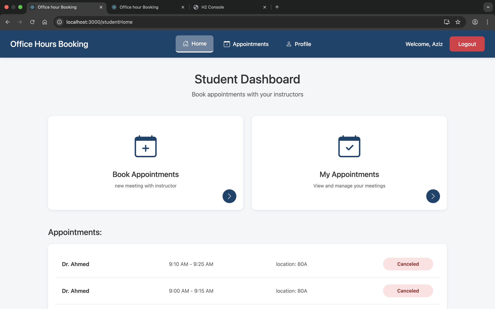
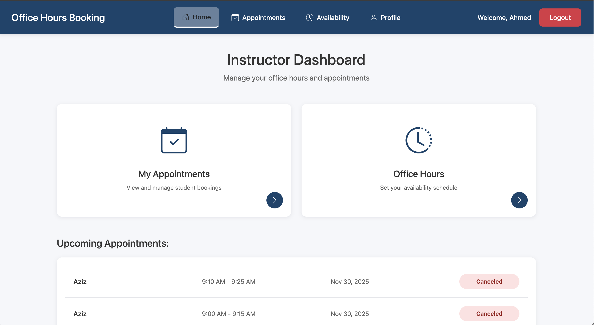
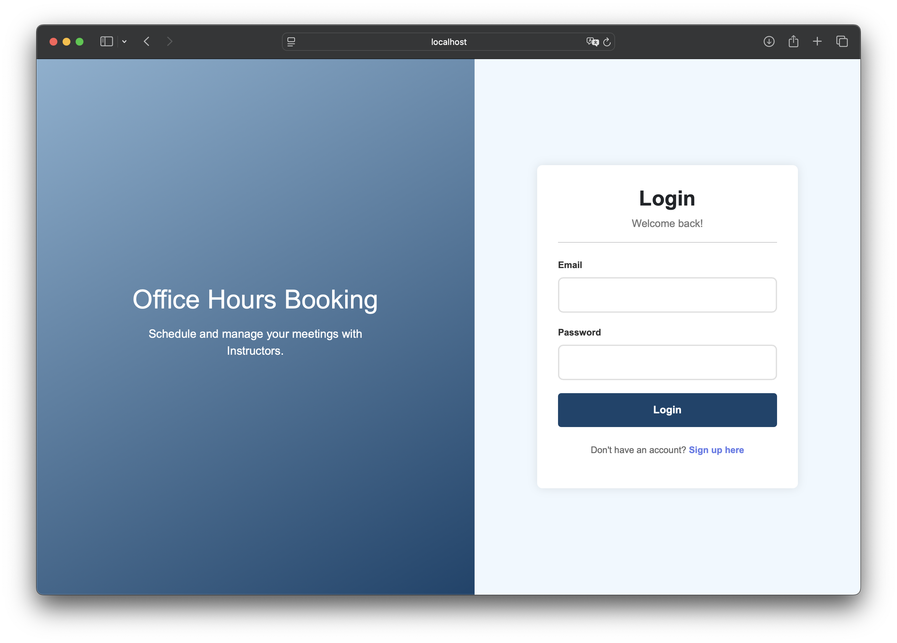

# Office Hour Booking System

A web-based system that enables students to book office hour appointments with instructors, while instructors can manage their availability, schedules, and bookings.

## Features

* **User Authentication** (Login + Signup)
* **Role-Based Access** (Students & Instructors)
* **Office Hour Scheduling**
* **Appointment Booking**

## Usage

### Download and Run 

1. **Download the latest release** from [Releases](https://github.com/CPIT252-IT1-Fall25/course-project-officehourbooking/releases/tag/V1.0)
   - Download: `course-project-1.0-SNAPSHOT.jar`
   - This JAR contains both frontend and backend

2. **Run the application:**
```bash
   java -jar course-project-1.0-SNAPSHOT.jar
```

3. **Open your browser:**
```
   http://localhost:8080
```

**Requirements:** Java 20 or higher


## 📁 Project Structure
```

course-project-officehourbooking/
├── src/main/java/                 # Backend source code
│   └── sa/edu/kau/fcit/cpit252/project/
│       ├── auth/                  # Authentication & authorization
│       ├── booking/               # Booking management
│       ├── availability/          # Instructor availability
│       ├── doctor/                # Instructor (Doctor) entities
│       ├── student/               # Student entities
│       └── notification/          # Notification system
├── src/main/resources/
│   ├── static/                    # Embedded React frontend
│   └── application.properties     # Configuration
|
|
├── officehourbooking-frontend/    # React frontend source
│   ├── src/
│   │   ├── Component/
│   │   ├── context/
│   │   ├── services/
|   |   └── App.js
│   │── public/
│   └── package.json
├── pom.xml                        # Maven configuration
└── README.md

```


## Screenshots

### Student View

*Browse instructors and book appointments*

### Instructor View

*Manage availability and view bookings*

### Login Page

* authentication for students and instructors*

## Developers

This project was developed by:

* **Abdulaziz Almutairi** - [GitHub](https://github.com/iazizlo)
* **Mohammed Alharbi** - [GitHub](https://github.com/M7med7)


## Course Information
- **Course:** CPIT 252 - Software Design Pattern
- **Institution:** King Abdulaziz University
- **Faculty:** Faculty of Computing and Information Technology
- **Semester:** Fall 2025

## Acknowledgments

- **Dr. Khalid Alharbi** - Our instructor and mentor
- **King Abdulaziz University** - Faculty of Computing and Information Technology
- **Spring Boot and React teams** -  for their excellent frameworks and documentation.

## License
This project is created for educational purposes as part of the CPIT-252 course at King Abdulaziz University.


---
<div align="center">

### ⭐ If you find this project helpful, please give it a star!

Made with ❤️ by KAU FCIT Students

**Office Hour Booking System** | CPIT-252 | Fall 2025

</div>


